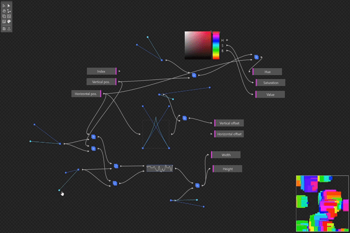
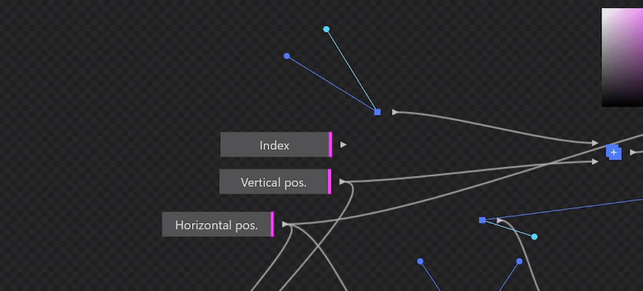
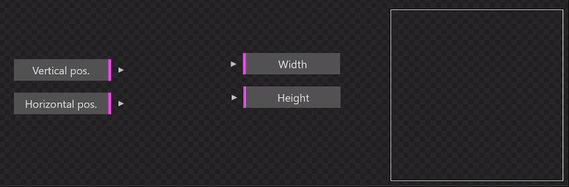
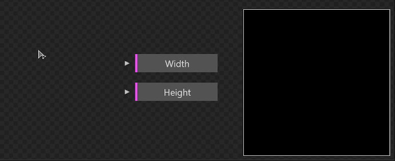
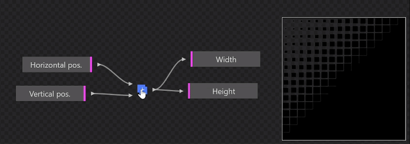
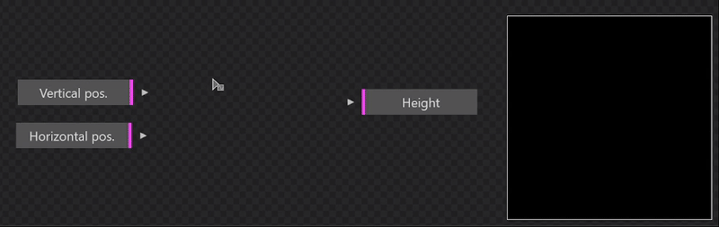
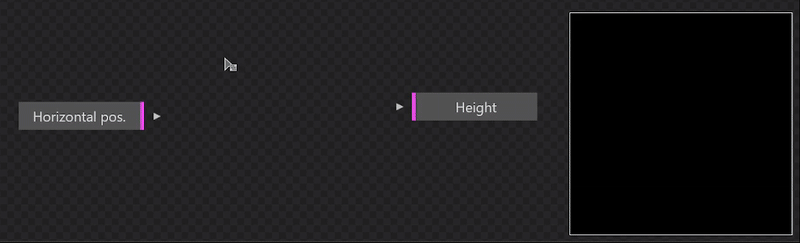
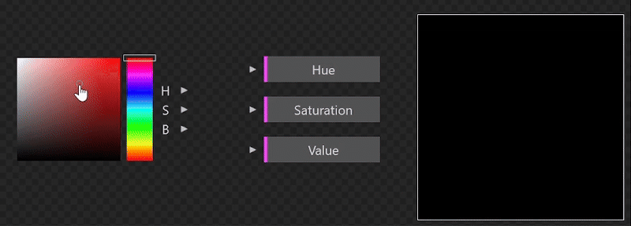

# README.md

# 2P4D ⬤───■─⬤

# Introduction

2P4D (To program for design) is a programming tool aimed to reuse designer’s practices as the programming experience. Inherited from the manipulations and general graphics from Adobe Illustrator, 2P4D tries to provide users with an intuitive starting point for them to learn programming.

Based on my research [“Vector coding” (written in french)](https://estebanver.net/memoire/), 2P4D questions the main user experience found in most modern creative coding IDEs. As pointed in my research, there is no design-based user experience for creative coding, where existing ones have a systematical approach to linguistics and textual arithmetic. 

The challenge for this new IDE is to create a more visual and interactive interface that allows designers to intuitively manipulate and experiment with their code. More precisely, 2P4D is a node-based programming system with design-focused interactions and graphics through the few nodes that are provided to users.

This project is a proof of concept and is not meant to be a perfect system with infinite possibilities. In fact, the output given by the program is very limited, because the main subject is about the experience itself, not what it can generate.

# Installation

You can either try the tool [on my website](https://estebanver.net/tools/2p4d/) or install it locally by simply downloading the source code and opening the **index.html** file (no server setup required).

# Usage

2P4D is based on node-based programming systems, which means that the main idea is to create nodes (representing human-machine instructions or operations) that you can connect together to form instruction chains that function as executable code. The general workflow is to add nodes, tweak their properties, then connect them together. I will not elaborate further on the node feature of the program, but if you want to have more informations about this concept, you can check out this [wikipedia page](https://en.wikipedia.org/wiki/Node_graph_architecture)

2P4D lets you create programs that generate a 16x16 grid of squares, where your code defines each square's size, color, and offset from its original position. By default, the workspace includes base input and output nodes. 

Input nodes appear on the left and represent the properties of individual squares. Since these input properties are unique for each square (based on their position), each square's result will be different.

Output nodes are the result properties drawn on the result (shown on the bottom right). So, in order to create a working program, you need at least to connect nodes to one of the outputs. 

# Tools

There is currently 3 workspace manipulation tools and 5 different nodes. Every tool and node is explained below.

## Selector cursor

This tool lets you select nodes and move them around. You can either directly click on the node you want to select or drag a selection box in order to select multiple nodes. After the selection, you can drag and drop your selected node•s to move them around. To delete a selected node, press the Delete key.

## Tweaker cursor

Use this cursor tool to modify or connect nodes. This tool is required for editing the properties of nodes you've created, as other tools cannot interact with them directly. To connect nodes, select an output (triangle on the right side of a node) and drag it to an input (triangle on the left side), or vice versa. For the properties of a node, go to the node’s respective description to see how they works. 

## Hand tool

The hand tool lets you navigate your workspace by dragging anywhere on the canvas. You can also press the spacebar to temporarily activate the hand tool.

# Node tools

The five node tools let you create nodes by clicking anywhere on the workspace. After creating a node, use the **Tweaker** to modify it. Note that any nodes can be connected together, so fell free to try out anything!

## Value

The value node is one of the most fundamental nodes, designed to generate a fixed number. The blue anchor lets you increase the value by dragging outward from the center in a spiral pattern. The cyan anchor lets you tweak this value more precisely, and is defined by the angle difference between itself and the other anchor. When dragging a node, you can press shift to lock the anchor’s distance from the center point while you move it around (which makes the tweaking process easier).

## Operator

This node merges two values together. After connecting values to both inputs, use the Tweaker tool to click on the node and select your desired operation. The output will display the result.

## Generator

The generator node creates new values using its inputs. When you click to place it on the workspace, a selection window opens, allowing you to choose which generator type to use. Note that some generators have multiple inputs and require all inputs to be connected to function properly.

## Curve generator

Similar to the generator node, the curve generator lets you create new values from its inputs, but using a curve as its modifier. After adding the node, use the **Tweaker** to move the four control anchors around, modifying the curve as a result. 

## Color

The color node is a color picker with three outputs using HSB color mode, the standard in most design tools. Use this node to visualize your color selection, which can then be processed further with other nodes.

